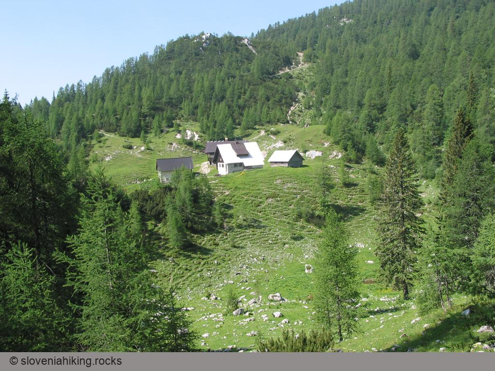

The route from Rudno polje to Lipanca is an ideal family trip -- it starts as a gentle walk through the mighty Pokljuka spruce forests, continues with a slight ascent on the margin of the Pokljuka plateau, becomes somewhat more diverse and ends on the fairly steep grass slopes below Lipanca, from where you finally reach the mountain hut Blejska koča.

Hardier mountaineers will need about one and a half hours for the trip, but if you take children with you, more time will be necessary, especially if you go there in August, when these forests are full of strawberries and bilberries.

### At a glance

**Difficulty**
:   An excellently waymarked, pleasantly varied route with short somewhat steeper sections.

**Access**
:   The hike starts from Rudno polje, which is better known as the venue for cross-country skiing competitions.

**Distance**
:   Rudno polje -- Lipanca: 1 hour, 30 minutes\
    Return: 1 hour, 15 minutes\
    Total: 3 hours

**Altitude**
:   1630 m

**Height difference**
:   310 m

**Season**
:   You can do this trip anytime, even in the worst summer heat the forest will generally protect you. And in winter many paths on Pokljuka are trodden through the snow.

**Recommended equipment**
:   In principle you could reach Lipanca even in sports footwear (and many people do), but because of the rocky path I would recommend mountain boots.

**Map**
:   Julijske Alpe, vzhodni del, 1 : 50 000

Through the Pokljuka forests
----------------------------

You reach Lipanca from Rudno polje, which you [travel to along the asphalt road across Pokljuka](http://www.biathlon-pokljuka.com/eng/arrival.html). Immediately beyond the military barracks there is a carpark on the lefthand side of the road where you can leave your car. You start the route along the macadam road past the barracks, which brings you after some minutes\' pleasant walk through the forest to a hunters\' hut and skiing grounds.

There are still no waymarks at the beginning of the route, but a single signpost directs you from the carpark past the barracks to Triglav.

Past the bottom lift on the ski slope you can set off along the macadam road (at the first turn-off you\'ll notice a signpost for Blejska koča directing you to the right), or you can ascend right up the edge of the ski-slope and so shorten the way a bit, which you then continue along the forest road. After approximately 750 metres this road will lead you to a gravel pit, and behind it another signpost points you to a cart-track which bears left into the forest.



It\'s possible to drive by car as far as this gravel pit, nor should there be any problems with parking.

The considerably neglected yet well-marked cart-track begins to rise gently through the almost dark spruce forest (in the summer months the shade is ever so welcome), and soon the mountain path branches off right from the cart-track. A little before this point the first recreational hurdle is waiting for you -- some spruces lie across the path that were unable to resist storms. It is patently obvious that care for the Pokljuka forests, which in previous years were maintained in exemplary fashion, is slowly dying out, since there are three more similar obstacles on your way to Lipanca.



A short walk along a pleasantly varied footpath brings you to the margin of the Pokljuka plateau -- all of a sudden the easy path begins to rise ever more steeply, right to the short stiff climb which ends on the forest road; you cross this and continue on along the slope above the road.



Ascent to Lipanca
-----------------

Above the forest road the footpath again levels out, becoming somewhat more diversified -- short level stretches are generally followed by quick ascents and descents, while individual rocks scattered along the path additionally take care for variety. Despite having left the plateau, you still walk through dense spruce forest, which only after twenty minutes slowly begins to thin out -- you\'re approaching the meadows on Lipanca.

 

As the forest gets increasingly sparser, so the path also gradually becomes  steeper -- but there is still the final ascent over ever more open meadows on the margin of the alp. Lovers of wild flowers, who have noticed wood anemones, violets and wood-sorrel in the forests, will find here the first globe flowers and columbine, the blooms of alpine clematis and the remains of the last snow roses. 



The path over the meadows becomes increasingly open and sunny (in such places false helleborine gradually appears), and soon the path from Viševnik comes from the left. After some minutes you\'ll see the mountain hut Blejska koča in front of you -- only a few metres\' descent now separates you from a well-deserved rest and refreshment.



It is best to return to Rudno polje the same way as you came but you can decide on adding more variety to your trip -- you can carry on from Lipanca to the summits in the ridge above. The shortest, though pretty steep climb will be to [Lipanski vrh](lipanskivrh.html), a longer and easier one takes you to [Debela peč](debelapec.html), while the most demanding one means returning to Rudno polje over [Viševnik](visevnik.html).


