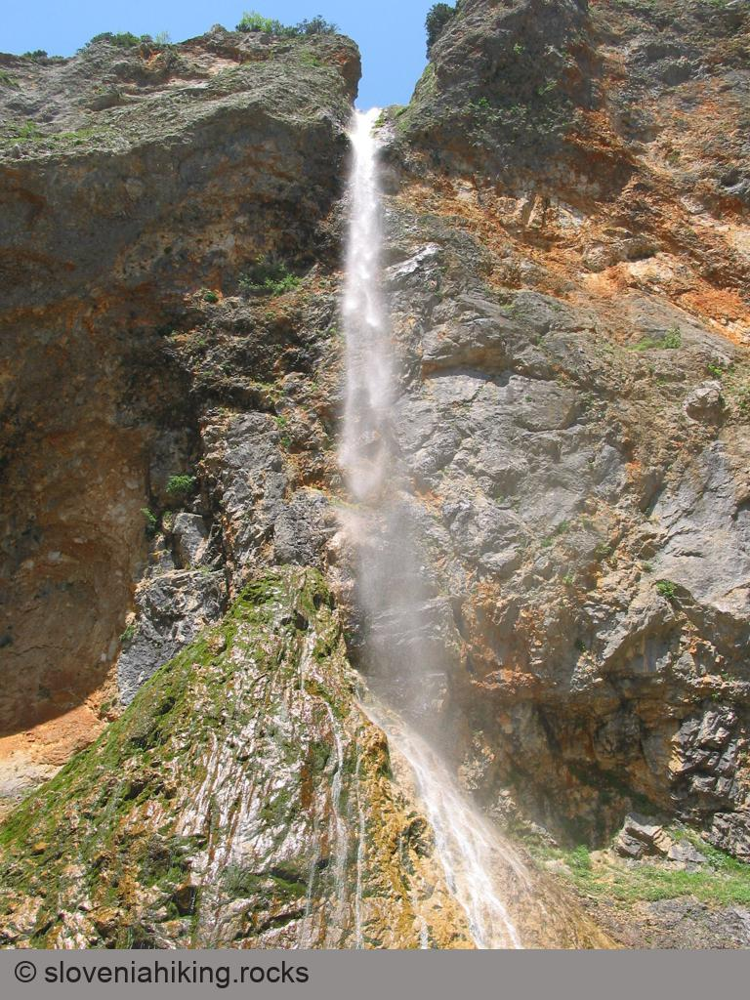
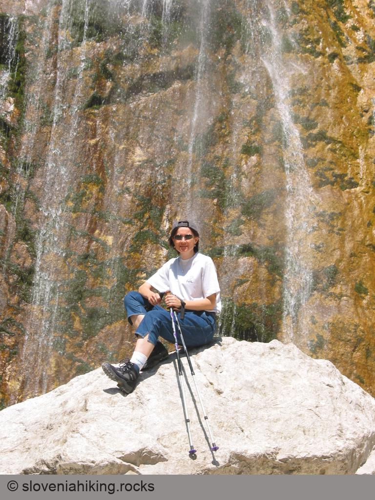
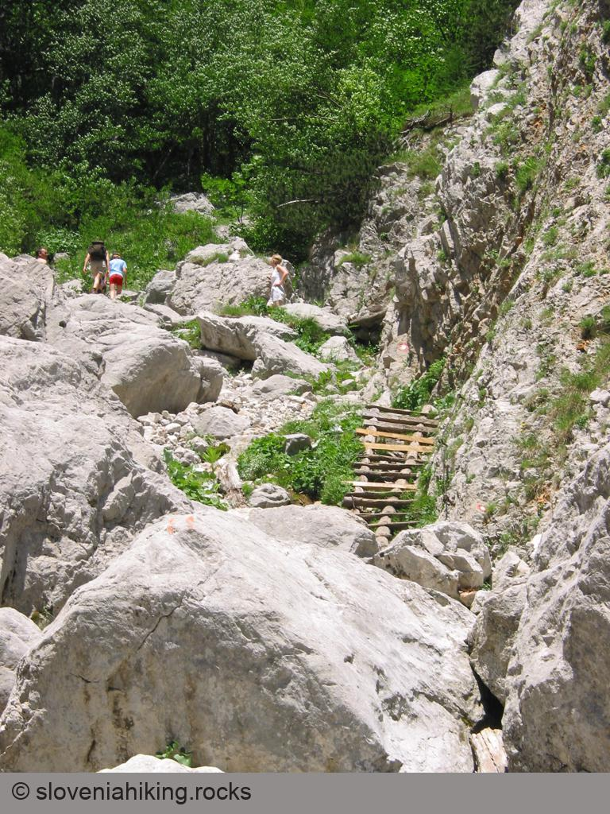
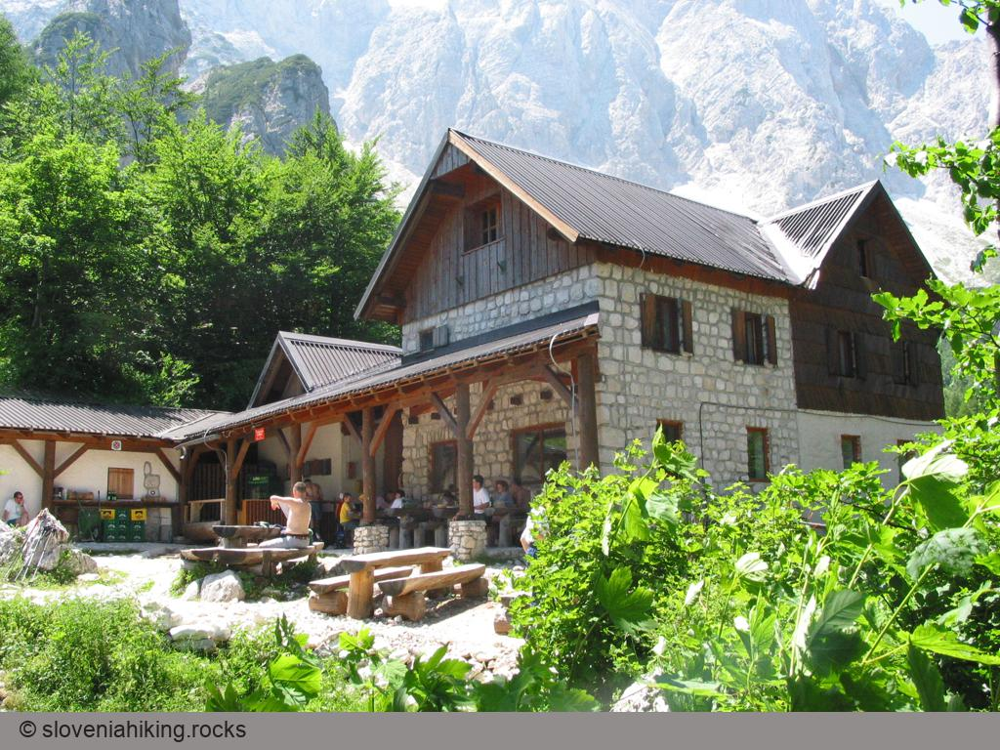
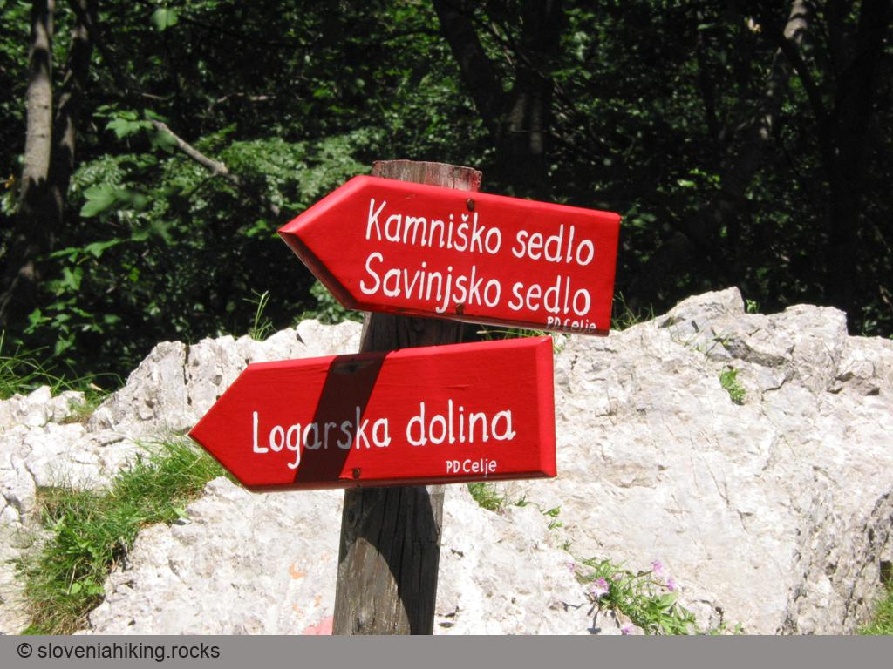
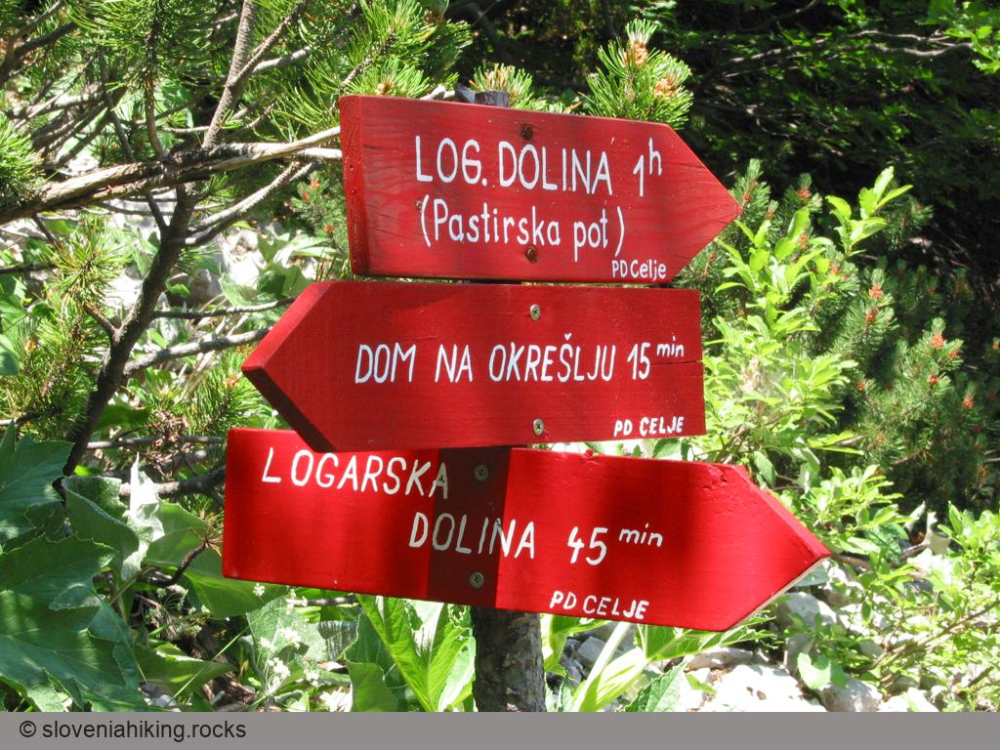

Osnovni podatki
===============

Zahtevnost
:   Strma, odlično označena pot. Pot delno poteka po zelo sončni legi, zato vam bo poleti pošteno vroče

Dostop
:   Pot začnemo v[Logarski dolini](?sect=2), avto lahko pustimo pri Domu planincev, lahko pa se odpeljemo vse do konca doline do parkirišča pred[slapom Rinka](?sect=3).

Dolžina
:   Dom pri Rinki -- Okrešelj: 1h. Povratek po planinski poti: 1h. Skupaj približno 2 uri hoje.

Višina
:   1395 m

Višinska razlika
:   400 m

Čas obiska
:   Če boste na Okrešelj odšli predvsem zaradi slapa Rinke, potem je seveda dobro oditi kmalu po obilnem deževju, drugače predlagam izlet ob lepem vremenu, da boste lahko uživali v razgledu z Okrešlja.

Priporočam
:   Dobro planinsko obutev (planinski čevlji), pohodne palice vas bodo morda zaradi strme poti celo ovirale. Pokrivalo in sončna krema ne bosta odveč.

O Logarski dolini boste na Internetu našli še precej podatkov, nekatere povezave so zbrane spodaj:

-   [Logarska dolina](http://www.logarska-dolina.si/)
-   [Krajinski park Logarska dolina](http://www.savinja.com/logarska.htm)
-   [Virtualna Slovenija - Logarska dolina](http://www.burger.si/Solcava/LogarskaDolina.htm)

Še en nasvet - če boste kliknili na katerokoli sliko, boste dobili večjo sliko v ločenem oknu.

Logarska dolina
---------------

::: {.sidebar style="width: 40%"}
Namig: pot v Logarsko dolino si lahko še skrajšate če na poti iz Kamnika proti Gornjemu gradu malo pred prelazom Črnivec  zavijete v smeri Kranjski Rak. Ta pot vas pripelje neposredno v Luče.
:::

[Logarska dolina](http://www.logarska-dolina.si/) je ena najlepših ledeniških dolin v Sloveniji, žal pa tudi ena od najbolj oddaljenih. Verjetno bo najhitreje (ne pa tudi najbližje), če boste z avtoceste Ljubljana -- Maribor zavili pri odcepu za Šentrupert in nato skozi Mozirje, Nazarje, Ljubno, Luče in Solčavo sledili znakom proti Logarski dolini (dobrih 60km). Tisti, ki prihajate iz Ljubljane ali Primorske in bolj uživate v počasnejši vožnji po bolj slikovitem okolju pa boste verjetno ubrali pot preko Kamnika in Gornjega grada. V nedeljah vozi v Logarsko dolino tudi avtobus iz Ljubljane preko Domžal in Kamnika.

 

Vaša vztrajnost bo nagrajena, ko se bo po vožnji skozi ozko sotesko Savinje pred vami naenkrat odprl čudovit pogled na Logarsko dolino in Savinjske alpe v ozadju. Če se vam ne mudi, si lahko pred nadaljevanjem poti ogledate še kapelo Kristusa kralja na začetku doline.

Če si želite krajši sprehod po dolini, pustite avto pri Domu planincev (837 m) drugače pa se lahko zapeljete vse do konca doline do parkirišča pri Koče pod slapom Rinka (1000 m) in začnete svojo pot [proti slapu Rinka](index.asp?sect=3) in Okrešlju.

Slap Rinka
----------

Že nekaj minut po začetku vzpona boste prišli do enega najvišjih slovenskih slapov - slapa Rinka, končnega cilja množice nedeljskih obiskovalcev. Savinja, ki izvira višje pod Okrešljem, v tem slapu pada preko skalnega roba več kot 90 metrov globoko. Žal je poleti slap navadno precej izsušen, tako, da lahko le slutite kako lep je v drugih letnih časih.

Ohladite se v bližini slapu, prečkajte most preko Savinje in nadaljujte pot po gozdičku na desnem bregu Savinje (ker se gibljete proti rečnemu toku, bo to seveda na vaši levi strani). Če si želite slap še bolje ogledati pa lahko pred nadaljevanjem poti zavijete še na kratko okrepčilo v bife Orlovo gnezdo na čudoviti lokaciji tik ob slapu.

Strma pot se po prijetnem gozdičku vzpenja neposredno ob robu slapu, tako, da lahko ves čas uživate v pogledu na slap in Logarsko dolino. Pojavijo se že prve planinske rože, med njimi lepi grmički sleča (rododendrona).





Pot vas pripelje do vrha slapa, kjer ponovno prečkate Savinjo, si ogledate vrh slapa in [nadaljujete vzpon proti Okrešlju](index.asp?sect=4).

Vzpon
-----

Gozdička je pred vrhom slapa Rinka konec, strm vzpon, občasno tudi po lestvah, se nadaljuje po strugi Savinje. Ob poti boste lahko opazovali množico manjših izvirov in potočkov, ki se takoj izlijejo v Savinjo, s svojo vlago pa omogočajo rast zanimivi združbi rastlin, med katerimi boste hitro opazili oblasti repuš, lepen, preobjedo, Scheuchzerjevo zvončico in šebenik.  Znojenja na vročem soncu je konec ob izviru Savinje, kjer se lahko odžejate in ohladite v senci skal. 

Pot kmalu zavije v prijeten planinski gozd in, čeprav še vedno precej strma, postane precej bolj prijetna, mogočna drevesa in skale ob njih pa kar vabijo k kratkemu počitku. Do [Okrešlja](index.asp?sect=5) je le še dobrih 15 minut hoje, pot pa si lahko popestrimo z [opazovanjem rož](index.asp?sect=7) - v zgodnjem poletju boste videli cvetoče šipkove grmove, orlice in repuš.

Okrešelj
--------

Tik pred planino Okrešelj se pot zravna in po zložni poti boste prišli do cilja - Frischaufovega doma na Okrešlju (1385 m). Poleti je dom je odprt vsak dan in prijazen oskrbnik vam bo z veseljem pregnal žejo. Sedaj pa pozor - Doma nikakor ne smete zapustiti dokler ne poskusite izvrstnega borovničevega štrudlja - tako dobrega boste težko dobili kjerkoli drugje.

Pravi planinci bodo po kratkem počitku nadaljevali pot proti vrhovom v okolici Okrešlja ali proti Kamniškemu sedlu, tisti nekoliko manj pripravljeni pa se bomo [vrnili proti Logarski dolini](index.asp?sect=6), seveda pa si bomo najprej ogledali čudovit razgled izpred Doma.



Le kakšnih 100 metrov od Doma se od poti proti Logarski dolini odcepi pot na planino Okrešelj. Če ste ljubitelji rož ali lepih razgledov, je obisk le-te obvezen. Videli boste vse vrhove (večinoma višje od 2000 metrov), ki obkrožajo Okrešelj, pa tudi vrsto planinskih rož, tudi zlato jabolka in zlato pogačico.



Povratek
--------

 V Logarsko dolino se lahko spustite po poti, po kateri ste prišli, lahko pa kmalu po izviru Savinje zavijete na pastirsko pot, ki je nekoliko daljša, vendar poteka ves čas po prijetnem gozdu, ni tako strma (toplo jo priporočam vsem, ki imate tako kot jaz ob spustih težave s koleni), predvsem pa ni obljudena - tudi med poletnimi vikendi boste srečali le nekaj podobno mislečih planincev.



V začetku je tudi pastirska pot sončna, kasneje prečka dva hudournika, kjer boste kljub dobrim oznakam morali malce iskati markacije za nadaljevanje poti, nadaljevanje poti pa poteka po prijetnem senčnatem gozdu.

Ob poti boste [zlahka opazili](index.asp?sect=7) Sternbergov klinček, ranjak in zlata jabolka. Če pa boste slučajno videli ivanjščice, si jih pozorno oglejte - morda ste videli redko (in zaščiteno) Kamniško ivanjščico.



Če boste po povratku v Logarsko dolino lačni, boste dobro hrano zlahka našli v Domu planincev. Ob povratku domov pa je skoraj obvezen ogled [Mozirskega gaja](http://www.mozirskigaj.com/) (če se boste vračali skozi Mozirje) ali [Arboretuma v Volčjem potoku](http://www.arboretum-vp.si/) (če se boste vračali skozi Kamnik)..
