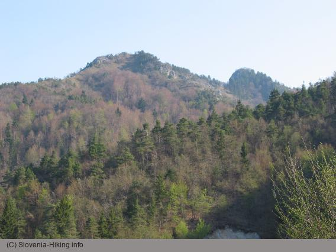

Polhograjska Grmada (898 m) je eden od najvišjih vrhov v Polhograjskem hribovju. Po sorazmerno položnih dostopih do Grmade se srečamo z zelo strmim in skalnatim vrhom, ki kljub nizki nadmorski višini daje vtis prave visokogorske pokrajine. Tudi rastline so prilagojene visokogorskim razmeram -- na Grmadi boste našli nekatere rože, ki jih najdete le na višjih vrhovih v predgorju slovenskih Alp (Blegoš, Porezen) ali v Alpah.

Kot se za tako zanimiv vrh spodobi, vodi na Grmado več markiranih poti -- nanjo se lahko povzpnemo iz Polhovega Gradca po treh različnih poteh (iz Pristave čez Ravnek, po Mačkovem grabnu ali skozi Setnico), iz Dvora in Belice pri Polhovem Gradcu, iz doline Ločnice ali pa se na Grmado podamo s Topola (sv. Katarine) nad Medvodami.

Težko je izbrati, katera izmed poti iz Polhovega Gradca je bolj zanimiva -- poti iz doline Božne (skozi Setnice in po Mačkovem grabnu) in iz Belice tečejo večinoma po gozdu, medtem ko pot čez Ravnek prečka nekaj zelo razglednih travnikov. Katerakoli pot iz Polhovega Gradca vam nudi možnost krožne poti, tako se lahko na primer na Grmado povzpnete čez Ravnek, vrnete pa se skozi Setnico.

### Izberi pot

* Vzpon čez Ravnek (520 m, 1 ura 30 minut)
* Vzpon iz Belice (560 m, 1 ura 30 minus)
* Iz Mačkovega Grabna čez Gonte (500 m, 1 ura 30 minus)
