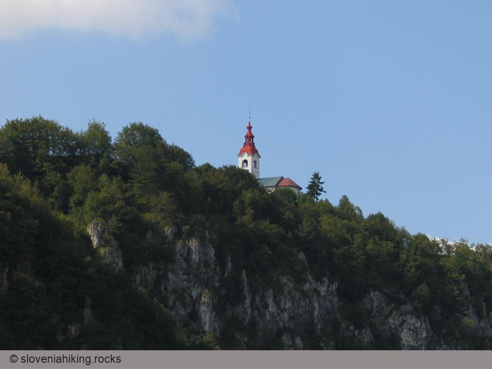

When you\'ve been driving between Idrija or Cerkno and Tolmin, you\'ve perhaps noticed St John\'s church (sv. Ivan) gleaming on top of the high steep faces above the Idrijca valley. Seeing it and the steep slopes and gullies that surround it on all sides, scarcely anyone can imagine that behind the church stretches the practically unknown sunny and hilly plateau Šebreljska planota. You can climb up to sv. Ivan by a waymarked path from Reka, and another path leads to it past Divje babe (now famous caves where even in prehistoric times they played on bone flutes), and after a short rest there, you can set off on a leisurely walk through this sunlit, hilly region.

### At a glance

**Difficulty**
:   A waymarked, occasionally fairly steep path.

**Access**
:   The route begins in Reka, a hamlet on the road between Idrija and Tolmin

**Distance**
:   Reka--cerkev sv. Ivana (St John\'s church): 1 hour\
    Walk across Šebreljska planota: 1 hour\
    Descent to the valley: 45 minutes\
    Total: 3 hours

**Altitude**
:   Sv. Ivan: 575 m\
    Gorenja vas v Šebreljah: 630 m

**Height difference**
:   Reka -- cerkev sv. Ivana: 340 m\
    Together with the walk around Šebrelje: 420 m

**Season**
:   You can make this trip at all seasons of the year, I would only advise against it after heavy rain or in mid-winter (the icy rocks below Šebreljska planota can be dangerous). Of course you\'ll enjoy the view of the Cerkljansko hills and the Lower Bohinj mountains only in clear, fine weather.

**Recommended equipment**
:   The path is steep in some places -- good footwear and trekking sticks are appropriate. In the lower part the path is overgrown, so in summer insect repellent is virtually obligatory.

**Map**
:   Škofjeloško in Cerkljansko hribovje, 1 : 50 000

From Reka to sv. Ivan
---------------------

The route to Šebrelje begins in Reka, a hamlet on the road between Idrija and Tolmin. If you drive to the starting-point through Idrija or Cerkno, Reka is the first hamlet after the junction where the road branches off for Cerkno, while if you come from the Tolmin direction, Reka is the first hamlet after Stopnik. Opposite the junction where a side road branches off for Bukovo and Zakojca you\'ll find quite a big carpark, which you can safely use, and then set off back towards Reka. After some metres a macadam road turns off on the right down towards the Idrijca river, at the junction you\'ll also notice a signpost which promises you a walk of 1 hour, 45 minutes to Šebrelje.



The macadam road quickly dops down to the Idrijca, crosses it by a fairly solid bridge, and then winds by the edge of a meadow to a turn-off by a hay-hut, where the waymarks direct you sharply right. Continue uphill on the macadam as far as the last house, where with some luck you\'ll see a waymark placed high up on the meadow behind the house. Go left across the yard, and then straight up along the remnants of an old cart-track. This bears slightly right  and then completely disappears, leaving you with only a narrow, but fairly well-used little path, which climbs steeply into the forest. At first it simply heads straight up the slope, but when this becomes too steep, it changes to short zig-zags, bringing you after about half an hour\'s ascent to a ridge from which you can already see between the trees the neighbouring summits of the Idrijsko hills.



On the ridge the path turns right and follows it comfortably to a rocky edge, above which you\'ll probably observe the gleaming walls of sv. Ivan. The path now turns left before the rocks and takes you into increasingly precipitous terrain, but then manages to find a natural passage through the rocks, twisting right and again left, and guides you without difficulty along fairly broad ledges above the rocks (while walking along these rock ledges watch out for snakes). 



From the ledges the path turns again into the forest, which brings to an end the view of the Sevnica ravine and surrounding summits, and some minutes later you find yourself on a broad cart-track leading over surprisingly gentle meadows. Turn right and in a few minutes you see the beautifully restored church of sv Ivan in front of you.



The church is consecrated to John the Baptist (Janez Krstnik), but the local people persist in calling it sv. Ivan.

After a short rest in the shade of the trees growing around the church and before continuing your trip, you must by all means walk to the northern defence wall and climb up onto it -- you\'ll be rewarded with an excellent view of part of the Lower Bohinj mountains appearing above the ravine Bukovska grapa through a gap between the plateau Šentviška planota and the summit  of Kojca; you\'ll soon pick out Porezen in Bukov vrh as well, while far behind them, on a clear day,  the typical bald top of Blegoš is there to greet you.



From the church you can set off on a walk around Šebreljska planota (I recommend it!), or drop down to the caves Divje babe (the well-marked path begins right by the church) and then try to find the little path that leads into the valley, but if you\'re short of time, it\'s best to return to the valley the same way as you came.

A circular route around Šebreljska planota
------------------------------------------

It\'s certainly sensible to continue your ascent to the margin of Šebreljska planota with a leisurely walk around this hilly and sunny plateau. The cart-track leads you from sv. Ivan to the village of Dolenja vas, where it changes into a narrow asphalt road (now and then we mountaineers must pay the price of progress), which after a short ascent past Kovk, which rises on the left, leads to the meadows and fields around beautifully arranged Gorenja vas. Before the cross-roads where the road from Stopnik enters the village, turn left uphill between the old houses tightly squeezed together to the church of sv. Jurij (St. George) and then continue left by the church and slowly start to return towards Srednja vas.



Behind the first houses the asphalt road changes to a cart-track that takes you straight ahead but just before the next stretch of asphalt begins you turn up to the right along a rather indistinct cart-track. This soon changes into a well-trodden little path leading behind the houses towards Kovk (where you\'ll quickly notice an enclosure used for breeding deer). When the path reaches the meadow below the enclosure it disappears; look for its continuation on the edge of the forest straight across the meadow.



After a short walk through the forest you find yourself in the next meadow, where the path changes into a cart-track beside a log cabin and brings you to the houses in Dolenja vas. From there return by the cart-track to sv. Ivan and then descend to the valley by the waymarked path or the route past Divje babe.

The descent into the Sevnica valley
-----------------------------------

Those who like finding almost forgotten and abandoned little paths will certainly enjoy the descent by the old path into the Sevnica valley, which the local people used whenever the route via sv. Ivan was too hot. The path is very accurately shown on the Geodetska uprava 1:25 000 map so that lucky owners of a GPS receiver will easily find it, but others with keen eyes and a little orienteering ability won\'t have any difficulties.



The route begins where the path past Srednja vas towards Dolenja vas loses itself in the meadow. Instead of searching for its continuation straight ahead on the far side of the meadow, turn down some thirty metres or so over the slope and look for a path that from the edge of the forest gradually drops down towards the north (to the left). A short descent is followed by some rock steps that enable you to overcome a short rock wall. Soon after that you\'ll notice a fork: the righthand path leads towards the Čufar farm, but you turn left and in a few minutes come to interesting rock overhangs (according to the locals\' accounts, chasms in these rocks are linked with Divje babe, while an attentive ear will also catch the sound of subterranean waters).

From here the path still leads you leftwards, reaching a small grassy ridge.  With a few strides along the ridge you can detour to a viewing point from which you\'ll admire the cliffs below sv. Ivan, then return to the path and continue to drop down along the gully/ravine. At the start of the gully the path virtually disappears by a rockfall; look for its continuation lower down in the forest, and then a definite little path leads all the way to the meadows above Munh (a farm immediately above the Sevnica river). At the beginning of the meadows the path is sliced by scree; skirt this along its upper edge, and then try to follow the path through the tall grass that covers the abandoned meadows above the farm.



When you reach the farm, you\'ll soon notice an old broad cart-track which goes to the right into the valley.  This quickly narrows to a path that takes you to a stream.  Cross this by the stones (probably there is a bridge but I didn\'t find it), and then head uphill by an old hay-hut to a cart-track that soon drops down to the next farm (Munhajše). There a macadam road begins which leads you beside the stream to the turning by the hay-hut where you started the ascent to Šebrelje.  Only some minutes\' walk now remains back to the carpark.



