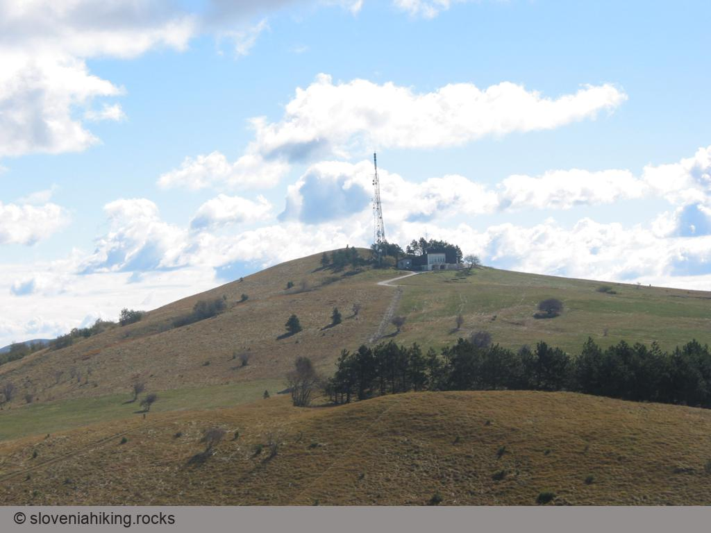

Slavnik je najbolj obiskan vrh Slavniškega pogorja -- zadnjega grebena pred Kraškim robom in slovensko Istro -- in eden zadnjih tisočakov pred slovenskim morjem s čudovitim razgledom na Piranski in Tržaški zaliv, Istro ter na okoliške vrhove -- [Vremščico](../Vremscica), [Nanos](../Nanos) s Trnovskim gozdom in [Snežnik](../Sneznik). Ni čudno, da je priljubljen cilj primorskih izletnikov.

Na Slavnik vodi množica markiranih poti -- iz Hrpelj pelje pot po grebenu, s Podgorskega krasa (jugozahodno od Slavnika) vodijo nanj Slovenska planinska pot (SPP) iz Prešnice ter dve poti iz Podgorja, iz Matarskega podolja (severovzhodno od Slavnika) pa poti iz Bača pri Materiji, Markovščine in Skadanščine. Pot čez Skadanščino si lahko še dodatno podaljšamo z ovinkom mimo Malih vrat.

Poleg vseh teh markiranih poti se lahko na Slavnik odpravimo še po množici nemarkiranih kolovozov; najbolj znan je tisti, ki se začne pri lovski koči v Skadanščini in se nato pridruži poti iz Bača.

Množica poti vam omogoča, da si izberete tisto, ki ustreza vaši kondiciji in želji po vzpenjanju po strmih pobočjih.

**Pot**
:   **Višinska razlika**
:   **Trajanje**
:   **Zahtevnost**

[Podgorje--Slavnik](index.asp?pfx=PG)(položna pot)
:   510 m
:   3 ure
:   Položna

[Podgorje--Slavnik](index.asp?pfx=SP)(strma pot)
:   510 m
:   2 uri in pol
:   Strma

[Skadanščina--Slavnik](index.asp?PFX=MK)
:   450 m
:   3 ure
:   Večinoma položna

[Markovščina--Skadanščina--Slavnik](index.asp?PFX=MK)
:   470 m
:   4 ure
:   Večinoma položna

[Skadanščina--Slavnik--Mala vrata--Skadanščina](index.asp?PFX=MK)
:   450 m
:   5--6 ur
:   Večinoma položna

[Markovščina--Skadanščina--Slavnik--Mala vrata--Skadanščina--Markovščina](index.asp?PFX=MK)
:   470 m
:   6--7 ur
:   Večinoma položna

[Prešnica--Slavnik](index.asp?PFX=PR)
:   560 m
:   4 ure
:   Položna

[Prešnica--Slavnik--Podgorje--Prešnica](index.asp?PFX=PR)
:   560 m
:   5-6 ur
:   Položen vzpon, nekoliko bolj strm spust

Vse poti skozi Skadanščino so strme le v zadnjem delu, tik pod vrhom Slavnika. Strmini se lahko izognemo z ovinkom po makadamski cesti.

### Ostali podatki

**Višina**
:   Slavnik: 1028 m\
    Grmada: 1001 m

**Čas obiska**
:   Na Slavnik se nikakor ne bi odpravil v vročih poletnih mesecih -- večina poti nanj teče po redkih gozdovih, kjer bo poleti precej vroče. Za ljubitelje rož bosta najboljša meseca maj in september, na Slavnik pa se je lepo odpraviti tudi jeseni in pozimi, ko je večina Slovenije zavita v oblake ali meglo, le vetrovnih dni se izogibajte -- mene je burja skoraj odpihnila z vrha. Priporočljiv je seveda izlet v lepem in jasnem vremenu s čistim ozračjem, da boste uživali v razgledu.

**Priporočam **
:   Po večini poti na Slavnik se lahko odpravite v športnih copatih. Če se boste odločili za eno od strmih poti, pa se le preobujte v planinske čevlje in ne pozabite na palice.

**Karta**
:   Slovenska Istra, Brkini in Kras, PZS, 1 : 50.000

Na Internetu boste o Podgorju in Slavniku našli še nekaj podatkov:

-   Opis [Podgorja](http://www.koper.si/povezave/podezelje/podgorje/podgorje/podgorje.html)
-   Nekaj več podatkov o [Slavniku](http://obala.gore-ljudje.net/)

Razgled z vrha Slavnika
-----------------------

Na vrhu Slavnika vas v lepem vremenu čaka čudovit razgled -- lepo se vidi Trnovski gozd z Nanosom, v zelo lepem vremenu pa celo slovenske Alpe. Pred Tumovo kočo boste uživali v pogledu na okoliška hribovja in slovensko Istro, z bližnje [Grmade](index.asp?sect=5&pfx=PG) pa boste imeli še lepši pogled na Slovensko primorje (ki ga s Slavnika zakriva prav Grmada)

::: {.image style="text-align: center; clear: left;"}
\
Pogled proti Trnovskemu gozdu in Nanosu, na desni strani Vremščica
:::

::: {.image style="text-align: center; clear: left;"}
\
Pogled s Slavnika proti vzhodu
:::
