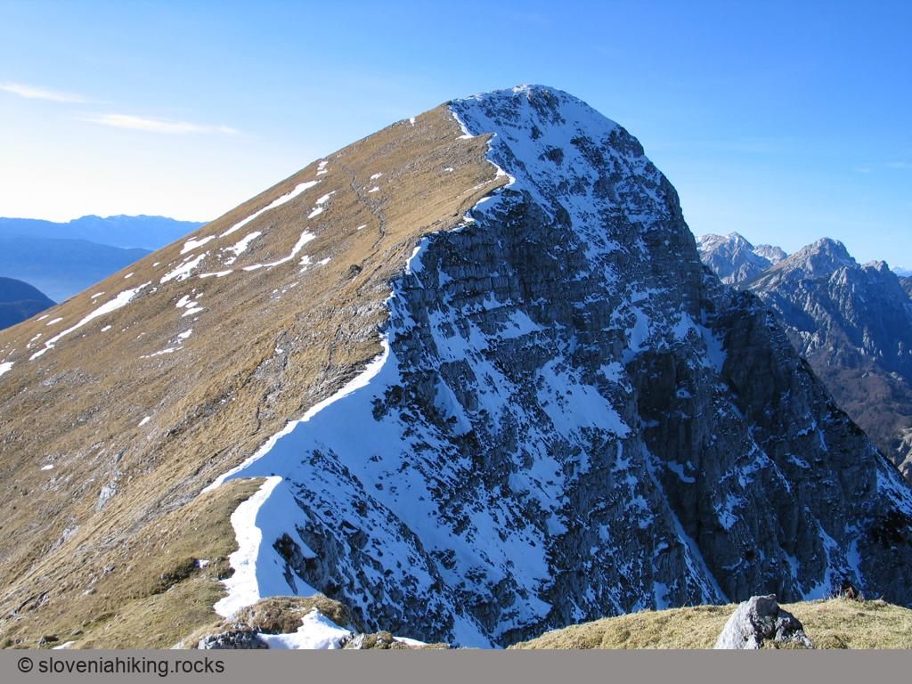

Atlas Slovenije pozna kar 83 Velikih V/vrhov, od teh 11 zaselkov (Vrhov) in 72 vzpetin (vrhov). Najnižja vzpetina je visoka 311 metrov (verjetno ste takoj uganili, da je tako nizek Veliki vrh lahko le v Prekmurju), trije pa si zares zaslužijo to ime, saj segajo nad dva tisoč metrov -- enega od teh dvatisočakov boste našli vzhodno od Ojstrice, drugega na Begunjščici (najvišji vrh grebena Begunjščice), tretjega, na katerega se bomo povzpeli, pa v grebenu Košute, v katerem je najzahodnejši dvatisočak.

Košutin Veliki vrh se proti zahodu in severu brani pred obiskovalci s strmimi pečinami, čez katere je speljana zanimiva plezalna pot, z vzhoda pa se nanj zlahka povzpnemo po travnatih pobočjih Kofce gore in nato po grebenu Košute mimo najnižjega slovenskega dvatisočaka (Toplar je visok natančno 2000 metrov).

### Osnovni podatki

**Zahtevnost**
:   Odlično označena, občasno nekoliko bolj strma pot.

**Dostop**
:   Na Veliki vrh se bomo povzpeli s planine Kofce, na katero vodi vrsta markiranih poti.

**Dolžina**
:   Kofce--Veliki vrh: 1 ura 30 minut\
    Vrnitev čez Kofce goro: 1 ura 20 minut\
    Skupaj: 3 ure in pol

**Višina**
:   2088 m

**Višinska razlika**
:   600 m

**Čas obiska**
:   Pot teče po južnih travnatih pobočjih in je zato v poletni pripeki neprijetno vroča.

**Priporočam**
:   Palice in planinska obutev so skoraj obvezne.

**Karta**
:   Karavanke, osrednji del, planinska karta 1 : 50.000, PZS

S Kofc na Veliki vrh
--------------------

Na Veliki vrh vodi ena tistih neprijetnih poti, ki jih ves čas vzpona vidimo daleč pred seboj. Če se za kočo na planini Kofce razgledamo po travnikih Košute, ki se dvigajo nad nami, bomo hitro opazili prečni greben Kofce gore, pod katerim se v levo zlagoma dviguje stezica, ki ji lahko sledimo vse do grebena nad nami, kjer za trenutek izgine in se nato spet pojavi pod pobočji Velikega vrha. 



Pogled nas kar malce zavede, saj se zdi, da do vrha ni daleč, svojo zmoto pa bomo spoznali že kar na strmih travnikih Kofc, po katerih se stezica nad kočo zažene naravnost navzgor mimo križa na vrhu planine. 



Na Križu, ki se dviguje dobrih 120 metrov nad planinsko kočo, se po strmem vzponu vsekakor splača usesti na klopco in uživati v prvih razgledih -- pred nami kot na dlani leži vsa planina, levo se dvigujejo grebeni Kamniških Alp, desno v ozadju pa Julijske Alpe, ki jih deloma zakrivajo Karavanke na skrajni desni strani.



Nad Križem postane pot bolj položna in nas zlagoma pripelje tik pod pobočje Kofce gore, kjer smo že z izhodišča opazili borov gozdiček, ki naj bi nas vsaj malce zavaroval pred soncem. Svojo zmoto bomo spoznali šele tik pred gozdičkom, ki ga (poleg nekaj borovcev) v glavnem sestavlja nadležno ruševje, skozi katero se prebijamo po strmi poti, posuti z velikimi skalami (mene je takoj spomnila na pot, po kateri se romarji valijo z Vogla na Šijo). 



Na srečo je ruševja kmalu konec in steza postane spet tako položna, uhojena in prijetna kot prej. Tik pred koncem ruševja se znajdemo na razcepu, kjer se od položne steze, ki vodi na Veliki vrh, odcepi strma pot, po kateri se lahko povzpnemo naravnost na Kladivo, ali pa se po pobočjih Košute sprehodimo do planine Šija (to je zanimiva krožna pot za tiste obiskovalce Kofc, ki ste se z avtomobilom pripeljali do Šije).



Hojo nadaljujemo po položni stezi na zahodnem grebenu Kofce gore (strmo pot po grebenu si bomo prihranili za vrnitev na Kofce) in se zlagoma vzpnemo do skal približno 100 višinskih metrov pod grebenom. Pred njimi nas čaka jeklenica, ki je tam bolj zaradi našega dobrega počutja kot zaradi potrebe, vsekakor pa jo je dobro izkoristiti in si tako olajšati vzpon čez skale. 



Na vrhu vzpona se nam zazdi, da smo že tik pod grebenom, dokler ne odkrijemo optične prevare -- steza nas zapelje v ozko, senčno dolinico. V njej se še dolgo v pomlad zadržuje sneg; pregazimo ga in se končno povzpnemo do grebena, kjer nas čaka lep razgled na koroško stran, ob odlični vidljivosti pa lahko v ozadju opazimo tudi avstrijske tritisočake.



Veliki vrh
----------

Pot po obisku grebena takoj zavije nazaj na travnata južna pobočja in nas pelje tik pod grebenom mimo Toplarja do naslednjega sedelca, s katerega se lahko čez travnike ob grebenu povzpnemo naravnost navzgor do Velikega vrha, lahko pa sledimo markirani poti, ki nas položno, le z občasnimi kratkimi vzponi, popelje vse do zahodnega grebena Velikega vrha, kjer se obrne v levo in zdirja naravnost na vrh.

 

Na Velikem vrhu nas pričaka veličasten razgled -- proti jugu se kot prej dvigujejo grebeni Kamniških in Julijskih Alp, nov pa je pogled na mogočne vrhove Karavank proti zahodu (pred nami ležijo Begunjščica, Stol in Vrtača) ter na ves greben Košute proti vzhodu.



 



Po počitku na Velikem vrhu se lahko vrnemo na Kofce po poti, po kateri smo se povzpeli, lahko pa izlet nekoliko popestrimo z vrnitvijo mimo Kofce gore. Tisti, ki ste se v bližino Kofc pripeljali z avtomobilom, boste morda mimo Kofce gore nadaljevali pot proti Kladivu, izletniki, ki so pot začeli v dolini, pa si bodo verjetno obisk Kladiva prihranili za kakšno drugo priložnost.

Vrnitev čez Toplar in Kofce goro
--------------------------------

Z Velikega vrha se lahko proti Kofcam spustimo po markirani poti ali pa kar ob grebenu Košute, za prvim sedlom pa markirano pot zapustimo in se po travniku sprehodimo do vrha Toplarja, najnižjega slovenskega dvatisočaka. Na vrhu bomo našli le mejni kamen, ki nam bo potrdil, da smo prišli na pravo točko. Po travniku se spustimo nazaj na markirano pot in ji sledimo do dolinice, po kateri smo se povzpeli do grebena. Tam pot na Kofce zavije navzdol, mi pa nadaljujemo po stezici, ki tik pod grebenom pelje proti Kofce gori pred nami.



Markirana pot nas po položnem vzponu pripelje na pobočja Kofce gore, na razcepu, kjer se v desno odcepi steza proti Kofcam (bodite pozorni -- oznak ni), pa zavijemo levo na ozko, komaj vidno stezico, ki nas po nekaj metrih vzpona pripelje do naslednjega mejnega kamna -- prišli smo na vrh Kofce gore. Z vrha se spustimo nazaj do markirane poti in se začnemo hitro spuščati po prečnem grebenu Kofce gore. 

V primerjavi z udobno potjo na Veliki vrh je ta steza precej bolj zahtevna, saj je dosti bolj strma, kamnita, manj uhojena, pa tudi pobočje, čez katero teče, je dosti bolj strmo kot tista, po katerih smo se vzpenjali.



Po krajšem spustu se spet znajdemo med ruševjem, steza pa nato zavije v desno, na vzhodno stran grebena, ob katerem smo se spuščali, in nas pripelje do prepadnega mesta, kjer nas spet pričaka jeklenica. Ob njej hitro premagamo nekaj metrov zelo zračne poti, ki nam ponuja čudovit razgled na planini Ilovica in Šija, nato pa nadaljujemo spust med ruševjem. Po nekaj minutah se naša pot priključi tisti, po kateri smo se povzpeli na Veliki vrh, od tod do malice na Kofcah pa je le še slabih petnajst minut hoje po prijetnih travnikih.

 
